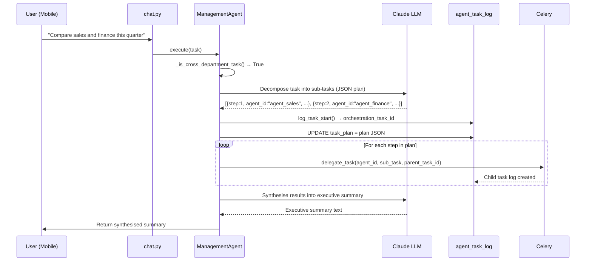
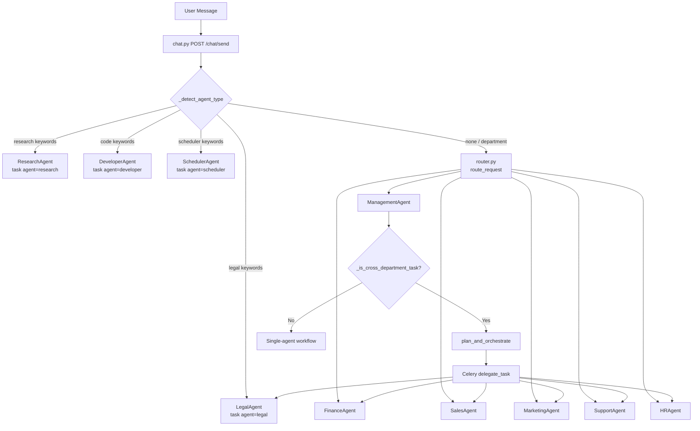

# Mezzofy AI Assistant — Agent Architecture Guide

**Version:** 2.1.0
**Last Updated:** March 20, 2026
**Audience:** Developers, Administrators

---

## Table of Contents

1. [Overview](#overview)
2. [Native Anthropic API Capabilities](#native-anthropic-api-capabilities)
3. [Entity Model](#entity-model)
4. [The 9 Agents](#the-9-agents)
5. [How Agents Work Together](#how-agents-work-together)
6. [Skills Catalogue](#skills-catalogue)

---

## Overview

The Mezzofy AI Assistant is built on a **9-agent team architecture**. Each agent is a persistent entity stored in the PostgreSQL `agents` table with its own identity, assigned skills, LLM model configuration, private knowledge namespace, and capability boundaries.

Agents are routed via `chat.py` → `router.py` → Agent class. The Management Agent doubles as an orchestrator for cross-department tasks.

---

## Native Anthropic API Capabilities

*(v2.1.0 — March 2026)*

The LLM layer has been upgraded to leverage the full native capability set of the Anthropic API. These are capabilities provided directly by Anthropic's infrastructure — no custom Python libraries, no external browser automation.

### Server-Side Tools

Server-side tools are executed by Anthropic's infrastructure, not by the Mezzofy backend. They are passed via `betas=["server-tool-use-2025-02-24"]` and handled by `chat_with_server_tools()` in `LLMManager`.

| Tool | Anthropic Name | Description |
|------|---------------|-------------|
| `anthropic_web_search` | `web_search_20250305` | Real-time web search — Claude queries and synthesises live results without a browser |
| `anthropic_web_fetch` | `web_fetch_20250124` | Fetch and read the full content of any URL, including paywalled or dynamic pages |
| `anthropic_code_execution` | `code_execution_20250522` | Execute Python code in an Anthropic-managed sandbox — no local execution risk |
| `anthropic_memory` | `memory` (beta) | Read and write a persistent key-value memory store per agent/user — survives across sessions |

**Key design note:** Server-side tools are incompatible with the standard `ToolExecutor` pattern. Agents that use them implement a separate agentic loop via `LLMManager.chat_with_server_tools()` rather than `execute_with_tools()`.

### Agent Skills (Document Generation)

Agent Skills are Anthropic-hosted document generation containers. They are activated via `betas=["files-api-2025-04-14", "interleaved-thinking-2025-05-14"]` and `container={"type": "persistent", "expires_at": ...}`. No external Python libraries (python-pptx, ReportLab, python-docx) are required.

| Skill | Beta Container | Output |
|-------|---------------|--------|
| `skill_pptx` | `files-api` + container | AI-native PowerPoint (.pptx) generation |
| `skill_xlsx` | `files-api` + container | AI-native Excel (.xlsx) generation |
| `skill_pdf` | `files-api` + container | AI-native PDF generation with full layout control |
| `skill_docx` | `files-api` + container | AI-native Word document (.docx) generation |

**Output:** Each skill run returns a `file_id` (Anthropic Files API reference). The artifact is retrieved via `client.beta.files.content(file_id)` and stored locally or returned to the user.

### Files API

The Anthropic Files API stores uploaded and generated artifacts in Anthropic's cloud under a persistent `file_id`. The `anthropic_file_id` column in the `artifacts` table (or equivalent) tracks these references.

| Operation | Description |
|-----------|-------------|
| Upload | `client.beta.files.upload(file, mime_type)` — stores PDF, image, or document in Anthropic cloud |
| Reference | Pass `{"type": "file", "file_id": "..."}` in messages — Claude reads the file directly |
| Retrieve | `client.beta.files.content(file_id)` — download generated output |
| Delete | `client.beta.files.delete(file_id)` — clean up after use |

### Memory Tool

The `memory` server-side tool provides persistent key-value state per agent and per user. It is distinct from the PostgreSQL `agent_task_log` — it is Anthropic-managed and optimised for lightweight agent/user preference storage that must persist across separate conversation sessions.

**Use cases:** User preferences, agent-learned context, cross-session state that would otherwise be lost when a conversation ends.

### LLM Layer — Dual Entry Points

`LLMManager` now exposes two entry points:

| Method | Used For |
|--------|---------|
| `execute_with_tools()` | Standard client-side tool calling (DatabaseOps, EmailOps, etc.) |
| `chat_with_server_tools()` | Server-side tools (web_search, web_fetch, code_execution, memory) and Agent Skills |

The `chat_with_server_tools()` method handles `pause_turn` stop reason, `server_tool_use` content blocks, and iterates the agentic loop until `end_turn`.

---

## Entity Model

### `agents` Table

```sql
CREATE TABLE agents (
    id              VARCHAR(50) PRIMARY KEY,      -- e.g. "agent_sales"
    name            VARCHAR(100) NOT NULL,         -- display name
    department      VARCHAR(50)  NOT NULL,         -- routing key
    persona         VARCHAR(50),                   -- persona name (Sam, Fiona, ...)
    description     TEXT,
    skills          JSONB        NOT NULL DEFAULT '[]',
    tools_allowed   JSONB        NOT NULL DEFAULT '[]',
    llm_model       VARCHAR(100),                  -- e.g. "claude-sonnet-4-6"
    memory_namespace VARCHAR(100),                  -- RAG isolation key
    is_orchestrator BOOLEAN      NOT NULL DEFAULT FALSE,
    is_active       BOOLEAN      NOT NULL DEFAULT TRUE,
    created_at      TIMESTAMPTZ  DEFAULT NOW(),
    updated_at      TIMESTAMPTZ  DEFAULT NOW()
);
```

### `agent_task_log` Table

```sql
CREATE TABLE agent_task_log (
    id              UUID PRIMARY KEY DEFAULT gen_random_uuid(),
    agent_id        VARCHAR(50)  REFERENCES agents(id),
    user_id         VARCHAR(100),
    department      VARCHAR(50),
    task_description TEXT,
    task_plan       JSONB,           -- orchestration step plan (Management only)
    status          VARCHAR(20),     -- pending / running / completed / failed
    result_summary  TEXT,
    parent_task_id  UUID REFERENCES agent_task_log(id),  -- delegation chain
    started_at      TIMESTAMPTZ,
    completed_at    TIMESTAMPTZ,
    created_at      TIMESTAMPTZ DEFAULT NOW()
);
```

**Delegation chain:** When the Management Agent orchestrates a multi-agent task, each sub-task row has `parent_task_id` pointing to the orchestration task row. This creates a full audit trail of who delegated what to whom.

---

## The 9 Agents

### Management Agent (Orchestrator)

| Field | Value |
|-------|-------|
| **ID** | `agent_management` |
| **Persona** | Max |
| **Department** | `management` |
| **Skills** | `data_analysis`, `web_research` |
| **Is Orchestrator** | ✅ Yes |
| **LLM Model** | `claude-sonnet-4-6` |
| **RAG Namespace** | `management` |

**Role:** Aggregates cross-department KPI data into executive dashboards and reports. As the sole orchestrator, it is the only agent that can decompose tasks and delegate to other agents.

**Typical tasks:**
- Cross-department KPI dashboard on demand
- Automated weekly KPI report (Celery Beat, Monday 9AM SGT)
- LinkedIn prospecting → CRM save → intro email
- Any cross-department comparative analysis

**Trigger keywords:** `kpi`, `dashboard`, `report`, `overview`, `performance`, `executive`, `audit`, `cost`, `usage`, `management`, `all departments`, `company-wide`, `revenue`, `summary`, `linkedin`, `prospect`, `lead`, `find`

**Cross-department orchestration trigger keywords:** `compare`, `versus`, `vs`, `across departments`, `all departments`, `cross-department`, `and sales`, `and finance`, `and marketing`, `and support`, `and hr`, `both departments`, `multiple departments`, `every department`

#### plan_and_orchestrate() Flow



---

### Finance Agent

| Field | Value |
|-------|-------|
| **ID** | `agent_finance` |
| **Persona** | Fiona |
| **Department** | `finance` |
| **Skills** | `financial_reporting`, `data_analysis` |
| **LLM Model** | `claude-sonnet-4-6` |
| **RAG Namespace** | `finance` |

**Role:** Financial analysis, KPI reports, revenue metrics, and department-scoped data access.

**Typical tasks:**
- Generate financial PDF reports with date ranges
- Query revenue, orders, and refund metrics
- Export financial data to CSV
- Create PowerPoint financial summaries

**Tools used:** `DatabaseOps` (financial queries), `PDFOps`, `PPTXOps`, `CSVOps`

---

### Sales Agent

| Field | Value |
|-------|-------|
| **ID** | `agent_sales` |
| **Persona** | Sam |
| **Department** | `sales` |
| **Skills** | `linkedin_prospecting`, `email_outreach`, `pitch_deck_generation`, `web_research` |
| **LLM Model** | `claude-sonnet-4-6` |
| **RAG Namespace** | `sales` |

**Role:** CRM lead management, LinkedIn prospecting, sales email outreach, and pitch deck generation.

**Typical tasks:**
- Search and update CRM leads
- LinkedIn people/company search → CRM save
- Batch personalized email campaigns
- Generate branded sales pitch decks

**Tools used:** `CRMOps`, `LinkedInOps`, `EmailOps`, `PPTXOps`, `PDFOps`

---

### Marketing Agent

| Field | Value |
|-------|-------|
| **ID** | `agent_marketing` |
| **Persona** | Maya |
| **Department** | `marketing` |
| **Skills** | `content_generation`, `web_research` |
| **LLM Model** | `claude-sonnet-4-6` |
| **RAG Namespace** | `marketing` |

**Role:** Marketing content creation, campaign email delivery, and competitive web research.

**Typical tasks:**
- Generate marketing copy and blog posts
- Batch email campaign delivery
- Web scraping for competitive intelligence
- Brand-compliant marketing material generation

**Tools used:** `EmailOps`, `WebScrapeOps`, `PDFOps`, `PPTXOps`, `DOCXOps`

---

### Support Agent

| Field | Value |
|-------|-------|
| **ID** | `agent_support` |
| **Persona** | Suki |
| **Department** | `support` |
| **Skills** | `data_analysis`, `email_outreach` |
| **LLM Model** | `claude-sonnet-4-6` |
| **RAG Namespace** | `support` |

**Role:** Support ticket management, SLA reporting, and customer communications.

**Typical tasks:**
- Query tickets by status, assignee, or date range
- Generate support performance reports
- Send support emails to customers
- Post updates to support Teams channel

**Tools used:** `DatabaseOps` (ticket queries), `EmailOps`, `TeamsOps`, `PDFOps`

---

### HR Agent

| Field | Value |
|-------|-------|
| **ID** | `agent_hr` |
| **Persona** | Hana |
| **Department** | `hr` |
| **Skills** | `data_analysis`, `email_outreach` |
| **LLM Model** | `claude-sonnet-4-6` |
| **RAG Namespace** | `hr` |

**Role:** HR data analytics, leave management, and employee communications.

**Typical tasks:**
- Query HR data tables (leave, headcount)
- Generate org chart and leave reports
- HR communications and notifications via email
- Export HR data to CSV

**Tools used:** `DatabaseOps` (HR queries), `EmailOps`, `CSVOps`, `HROps`

#### New Workflows (added 2026-03-28)

| Workflow | Trigger Keywords | Description |
|----------|-----------------|-------------|
| `_apply_leave_workflow` | apply leave, take leave, book leave, request leave | Staff applies leave; validates balance + dates, confirms with LLM |
| `_check_balance_workflow` | leave balance, days left, remaining leave, check leave | Returns current-year leave balances + upcoming applications |
| `_cancel_leave_workflow` | cancel leave, cancel my leave, withdraw leave | Lists cancellable leaves and confirms cancellation |
| `_manager_approval_workflow` | pending approval, approve leave, reject leave, direct report | Manager reviews and approves/rejects direct report leave requests |
| `_hr_staff_query_workflow` | employees on leave, who is on leave, leave summary | HR staff queries department-level leave status |

---

### Legal Agent (Special)

| Field | Value |
|-------|-------|
| **ID** | `agent_legal` |
| **Persona** | Leo |
| **Department** | `legal` |
| **Skills** | `document_review`, `contract_drafting`, `legal_research`, `jurisdiction_advisory` |
| **LLM Model** | `claude-sonnet-4-6` |
| **RAG Namespace** | `legal` |

**Role:** International business law specialist. Reviews and drafts contracts, provides jurisdiction-specific legal advisory, and flags legal risk across Singapore, Hong Kong, Malaysia, UAE/Saudi Arabia/Qatar, and Cayman Islands.

**Trigger:** Legal keywords in message from ANY department (contract, NDA, agreement, review contract, legal advice, governing law, clause, indemnity, non-compete, etc.) → `task["agent"] = "legal"`. Also delegatable from ManagementAgent via `delegate_task()`.

**Cross-departmental:** ✅ Any department can invoke Leo — legal needs arise across Sales (vendor agreements), HR (employment contracts), Finance (loan/investment agreements), Management (shareholder agreements).

**5 workflows:**
- `document_review` — extract text → classify → LLM structured analysis → branded PDF report
- `contract_generation` — extract parameters → load template → LLM draft → DOCX + PDF
- `clause_extraction` — LLM identifies and extracts named clause types as structured JSON
- `risk_assessment` — LLM risk matrix (Critical/High/Medium/Low) → formatted PDF
- `legal_advisory` — load jurisdiction knowledge → structured advisory text (no document generated)

**Mandatory disclaimer:** Every Leo output appends: *"This analysis is AI-generated for informational purposes only and does not constitute professional legal advice. Consult a qualified solicitor for binding decisions."*

**Jurisdictions covered:**

| Jurisdiction | Arbitration Body | Key Legislation |
|---|---|---|
| Singapore | SIAC | Companies Act, Employment Act, PDPA, Contract Act |
| Hong Kong | HKIAC | Companies Ordinance, Employment Ordinance, PDPO |
| Malaysia | AIAC | Companies Act 2016, Employment Act 1955, PDPA MY |
| UAE (onshore/DIFC/ADGM) | DIAC / DIFC-LCIA | Federal Companies Law, Labour Law, DIFC/ADGM Laws |
| Saudi Arabia | SCCA | Companies Law, Labor Law, PDPL (Shari'ah applies) |
| Qatar (onshore/QFC) | QICCA | Commercial Companies Law, Labour Law, QFC Laws |
| Cayman Islands | Grand Court / London | Companies Act 2023, AML Regulations |

---

### Research Agent (Special)

| Field | Value |
|-------|-------|
| **ID** | `agent_research` |
| **Persona** | Rex |
| **Department** | `research` |
| **Skills** | `web_research`, `data_analysis`, `deep_research`, `source_verification` |
| **LLM Model** | `claude-sonnet-4-6` |
| **RAG Namespace** | `research` |

**Role:** Agentic web-research specialist. Runs a multi-iteration search loop using Anthropic's native server-side `web_search_20250305` and `web_fetch_20250124` tools (or Kimi fallback), synthesising findings into a cited research report. As of v2.1.0, Rex no longer relies on Playwright browser automation — all web access goes through native Anthropic tools, resulting in faster, more reliable research with no browser dependency.

**Trigger:** `task["agent"] == "research"` (set by `_detect_agent_type()` in `chat.py` when message contains research keywords, or message starts with `"research:"`)

**Agentic loop (max 8 iterations):**
```
Iteration 1..N:
  → Send messages to Claude via LLMManager.chat_with_server_tools()
    with web_search_20250305 + web_fetch_20250124 tools enabled
  → Claude calls tool (server-side — no local execution)
  → Handles pause_turn stop reason, continues loop
  → Broadcasts step events (tool_call / tool_result) via Redis pub/sub → mobile
  → If stop_reason == "end_turn" OR N == max_iterations → exit loop
→ Return synthesised text as final result
```

**Key design decision:** Does NOT use `LLMManager.execute_with_tools()` — the `web_search_20250305` and `web_fetch_20250124` tools are server-side Anthropic built-ins, incompatible with the standard `ToolExecutor` pattern. Uses `LLMManager.chat_with_server_tools()` which handles `pause_turn` and `server_tool_use` content blocks natively.

**Skills detail:**
- `deep_research` — Multi-source synthesis + key fact extraction
- `source_verification` — Credibility scoring (high/medium/low), claim verification

---

### Developer Agent (Special)

| Field | Value |
|-------|-------|
| **ID** | `agent_developer` |
| **Persona** | Dev |
| **Department** | `developer` |
| **Skills** | `code_generation`, `code_review`, `code_execution`, `api_integration`, `test_generation` |
| **LLM Model** | `claude-sonnet-4-6` |
| **RAG Namespace** | `developer` |

**Role:** Runs Claude Code CLI as a headless subprocess for code generation, review, and execution tasks.

**Trigger:** `task["agent"] == "developer"` (set by `_detect_agent_type()` in `chat.py` when message contains code/build keywords, or starts with `"developer:"`)

**Subprocess command:**
```bash
claude --output-format stream-json --verbose --dangerously-skip-permissions -p "<query>"
```

**Stream-JSON event handling:**

| Event type | Step broadcast |
|-----------|---------------|
| `assistant` | `thinking` (first 300 chars of text block) |
| `tool_use` | `tool_call` (name + input[:150]) |
| `tool_result` | `tool_result` (content[:200]) |
| `result` | `done` + captures final result text |
| `error` | `error` step |

**Prerequisites:**
- Claude Code CLI installed: `npm install -g @anthropic-ai/claude-code`
- `ANTHROPIC_API_KEY` set in environment
- `claude` binary on Celery worker PATH (`/usr/bin` on EC2)

**Configurable:** work directory (`~/mezzofy-workspace` default), timeout (300s default)

---

### Scheduler Agent (Special)

| Field | Value |
|-------|-------|
| **ID** | `agent_scheduler` |
| **Persona** | Sched |
| **Department** | `scheduler` |
| **Skills** | `schedule_management`, `cron_validation`, `job_monitoring`, `beat_sync` |
| **LLM Model** | `claude-sonnet-4-6` |
| **RAG Namespace** | `scheduler` |

**Role:** Chat-based scheduled job manager. Accepts natural language requests and uses LLM tool-use to call the correct `SchedulerOps` tool.

**Trigger:** `task["agent"] == "scheduler"` (set by `_detect_agent_type()` in `chat.py` when message contains scheduler keywords)

**Runs synchronously** (no Celery) — scheduler CRUD ops are fast DB operations.

**System prompt instructs LLM to:**
- Only use scheduler tools (create, list, delete, run_now)
- Convert natural language times to UTC cron (`9AM SGT → 0 1 * * *`)
- Never invent job_ids — always fetch via list first
- Minimum interval: 15 minutes · Maximum: 10 active jobs per user

**Skills detail:**
- `schedule_management` — create_job, list_jobs, delete_job, trigger_now
- `cron_validation` — validate cron, compute next runs, explain, natural_to_cron
- `job_monitoring` — health_report, get_run_history
- `beat_sync` — sync_status, force_next_run_recalculation, get_static_beat_jobs

---

## How Agents Work Together

### Routing Flow



### AgentRegistry

`AgentRegistry` is a **database-backed singleton** loaded at application startup.

```python
# Load at startup
await agent_registry.load(db_session)

# Skill-based discovery
agents = agent_registry.find_by_skill("financial_reporting")

# Department lookup
agent = agent_registry.get_by_department("finance")

# Orchestrator
orchestrator = agent_registry.get_orchestrator()

# All active agents (for orchestration plan decomposition)
all_agents = agent_registry.all_active()
```

**Registry caching:** Once loaded, the registry is cached in-process. Agents table changes require a service restart to take effect.

### Delegation Chain

```
ManagementAgent.plan_and_orchestrate()
  → log_task_start() → orchestration_task_id (UUID)
  → For each sub-task in plan:
      delegate_task(agent_id, sub_task_payload, parent_task_id=orchestration_task_id)
        → Celery: process_delegated_agent_task.delay(payload)
          → agent_task_log row created with parent_task_id set
          → Target agent executes sub-task
          → log_task_complete() / log_task_failed()
```

**Result retrieval:** After delegation, ManagementAgent polls `agent_task_log` for `result_summary` from each child task, then synthesises with LLM.

### RAG Namespace Isolation

```python
# In BaseAgent._load_knowledge(namespace)
# Loads: knowledge/{namespace}/**  +  knowledge/shared/**
# Enforced at the BaseAgent level — no agent can request another agent's namespace
```

Each agent's `memory_namespace` field in the `agents` table maps directly to the folder path in the vector store. Finance data never appears in Marketing responses.

---

## Skills Catalogue

Full list of all 30 skills across the 10 agents (22 original + 8 new native API skills added in v2.1.0):

| Skill | Agent | Version | Description | Tools |
|-------|-------|:-------:|-------------|-------|
| `financial_reporting` | Finance | 1.0 | Financial summaries, KPI reports, revenue analysis | `create_report`, `export_csv` |
| `data_analysis` | Finance, Management, Support, HR, Research | 1.0 | Data aggregation, trend analysis, metric computation | `analyze_data`, `summarize` |
| `linkedin_prospecting` | Sales | 1.0 | LinkedIn search, profile extraction, CRM save | `linkedin_search`, `extract_profile` |
| `email_outreach` | Sales, Support, HR | 1.0 | Compose and batch-send personalized emails | `compose_email`, `send_email`, `send_batch` |
| `pitch_deck_generation` | Sales | 1.0 | Branded PowerPoint sales decks | `create_deck`, `add_slide` |
| `content_generation` | Marketing | 1.0 | AI-written copy, blog posts, campaign content | `generate_content`, `edit_content` |
| `web_research` | Sales, Marketing, Management, Research | 1.0 | Web scraping, competitive intelligence | `scrape_page`, `search_web`, `extract_contacts` |
| `deep_research` | Research | 1.0 | Multi-source synthesis with citation tracking | `synthesise`, `extract_key_facts` |
| `source_verification` | Research | 1.0 | Credibility scoring and claim verification | `score_source`, `verify_claim` |
| `code_generation` | Developer | 1.0 | LLM-based code writing with safety scanning | `generate`, `review`, `safety_scan` |
| `code_review` | Developer | 1.0 | Static analysis with severity-rated issue detection | `review`, `lint` |
| `code_execution` | Developer | 1.0 | Sandboxed code execution | `execute`, `run_tests` |
| `api_integration` | Developer | 1.0 | API client generation and integration code | `generate_client`, `test_endpoint` |
| `test_generation` | Developer | 1.0 | Unit and integration test generation | `generate_tests`, `validate_coverage` |
| `schedule_management` | Scheduler | 1.0 | CRUD on scheduled_jobs + Celery Beat sync | `create_job`, `list_jobs`, `delete_job`, `trigger_now` |
| `cron_validation` | Scheduler | 1.0 | Cron validation, UTC conversion, natural language → cron | `validate`, `compute_next_runs`, `explain`, `natural_to_cron` |
| `job_monitoring` | Scheduler | 1.0 | Health checks, failure detection, run history | `health_report`, `get_run_history` |
| `beat_sync` | Scheduler | 1.0 | Celery Beat sync status and next_run recalculation | `sync_status`, `force_next_run_recalculation`, `get_static_beat_jobs` |
| `document_review` | Legal | 1.0 | Extract, parse, and analyse legal documents (PDF, DOCX) | `extract_legal_document`, `identify_document_type`, `detect_parties`, `detect_governing_law` |
| `contract_drafting` | Legal | 1.0 | Generate business contracts from templates and parameters | `draft_contract`, `customise_clauses`, `get_contract_template` |
| `legal_research` | Legal | 1.0 | Research jurisdiction-specific laws and regulations | `research_jurisdiction_law`, `lookup_regulatory_requirements`, `check_compliance_requirements` |
| `jurisdiction_advisory` | Legal | 1.0 | Jurisdiction advisory for SG, HK, MY, UAE, KSA, QA, Cayman | `get_jurisdiction_overview`, `compare_jurisdictions`, `recommend_jurisdiction` |

### Native Anthropic API Skills *(v2.1.0)*

These skills map directly to Anthropic server-side tools and Agent Skills. They are not backed by custom Python tool classes — they are invoked through `LLMManager.chat_with_server_tools()`.

| Skill | Type | Version | Description | Anthropic Tool |
|-------|------|:-------:|-------------|---------------|
| `anthropic_web_search` | Server-side tool | 1.0 | Real-time web search via Anthropic infrastructure — no browser required | `web_search_20250305` |
| `anthropic_web_fetch` | Server-side tool | 1.0 | Fetch and read any URL directly — replaces Playwright for content retrieval | `web_fetch_20250124` |
| `anthropic_code_execution` | Server-side tool | 1.0 | Execute Python code in Anthropic sandbox — safe, isolated, no local risk | `code_execution_20250522` |
| `anthropic_memory` | Server-side tool | 1.0 | Persistent key-value memory per agent/user, survives across sessions | `memory` (beta) |
| `skill_pptx` | Agent Skill | 1.0 | AI-native PowerPoint generation — no python-pptx dependency | Files API container |
| `skill_xlsx` | Agent Skill | 1.0 | AI-native Excel generation — no openpyxl dependency | Files API container |
| `skill_pdf` | Agent Skill | 1.0 | AI-native PDF generation — no ReportLab dependency | Files API container |
| `skill_docx` | Agent Skill | 1.0 | AI-native Word document generation — no python-docx dependency | Files API container |

---

*Mezzofy AI Assistant — Agent Architecture Guide v2.1.0*
*For user-facing guidance, see [USER_GUIDE_AGENTIC.md](USER_GUIDE_AGENTIC.md)*
